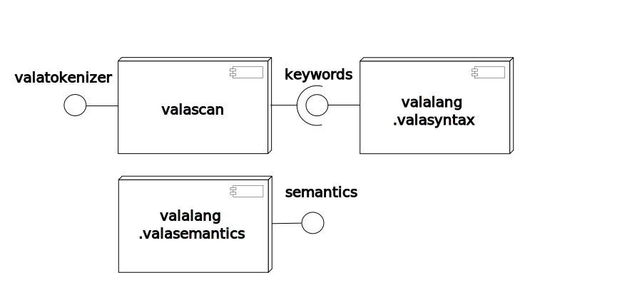

Vala compilation steps.
==================

* preprocessor
* syntax checking
* C Code generation
* Compile the C code into binary 
	* preprocessor
	* syntax checking
	* object code
	* linking

Architecture
==============

